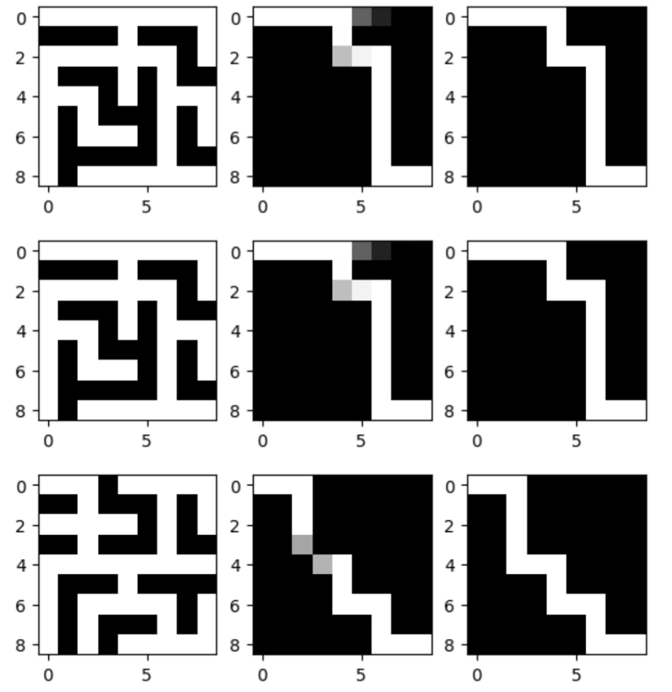
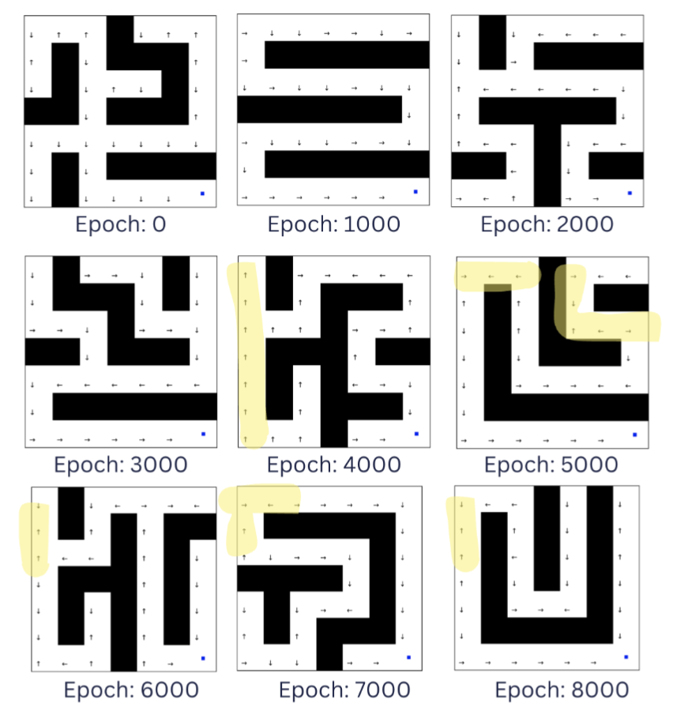

# AI Maze solving: Project for 50.021 Artificial Intelligence

Chen Yijia, Victoria Chong, Sim Shang Hong

[📄 Paper](https://drive.google.com/file/d/1YNJyN1WpFPL3h2eF4b3o885PCGv1MjS4/view?usp=sharing) | [💻 Slides](https://drive.google.com/file/d/1BTnpww6SvPsVTVmRYAavdXGwucZU4quD/view?usp=sharing)

## Abstract

This project is designed to leverage Artificial Intelligence (AI) to navigate mazes, with an emphasis on identifying the most proficient and effective AI-based strategies for this purpose. Our study encompasses a comparative analysis of several AI methodologies, including Autoencoders, Convolutional Neural Networks (CNNs), and Reinforcement Learning (RL), assessing their precision and computational efficiency across a range of maze complexities. In our exploration of CNNs, we conducted thorough testing across multiple iterations, involving an assortment of architectural models and variations in training paradigms. For RL, our experiments spanned focused on training a generalized DQN that can solve more than one maze. To establish a performance benchmark, these AI methods developed were evaluated against traditional graph search algorithms, notably Breadth-First Search (BFS), Depth-First Search (DFS), and A\* Heuristic algorithms. The comparative results indicate that the Autoencoder approach outshines other evaluated AI techniques, demonstrating superior performance in maze-solving tasks.

<figure style="display: inline-block; width: 45%; margin-right: 5%;">
  
  <figcaption style="text-align: center;">Sample Autoencoder test result for 15x15 maze size. Maze input (left), Model output (middle), Target output (right)</figcaption>
</figure>

<figure style="display: inline-block; width: 45%;">
  
  <figcaption style="text-align: center;">Showing the RL policy at 9 out of the 10 epochs</figcaption>
</figure>

## Findings

Analysing the results of the benchmarking completed above, we firstly observe that with regards to the Solution Accuracy metric, amongst the AI driven methods, the Autoencoder performed the best, followed by the CNN and then the RL. We chose to exclude the algorithms from this metric as they offer guaranteed solutions to the type of maze puzzles within our project scope.
